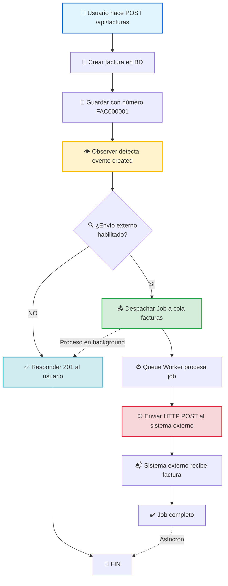

# Diagrama de Flujo - Sistema de Facturación

## 📋 Descripción del Sistema

Sistema de facturación Laravel con **Observer Pattern** y **Colas Asíncronas** que envía facturas automáticamente a un sistema externo.

---



---

## 📝 Versión Simplificada

```
┌─────────────────────────────────────────────────────────────┐
│ 1. Usuario → POST /api/facturas                             │
└────────────────────────┬────────────────────────────────────┘
                         ↓
┌─────────────────────────────────────────────────────────────┐
│ 2. Crear factura en BD                                      │
│    - Generar número: FAC000001                              │
│    - Calcular total de productos                            │
│    - Guardar en tabla facturas                              │
└────────────────────────┬────────────────────────────────────┘
                         ↓
┌─────────────────────────────────────────────────────────────┐
│ 3. Observer detecta factura creada                          │
│    FacturaObserver escucha evento "created"                 │
└────────────────────────┬────────────────────────────────────┘
                         ↓
                    ┌────┴────┐
                    │ ¿Envío  │
                    │ externo │
                    │ ON?     │
                    └─┬────┬──┘
                  SI  │    │ NO
        ┌─────────────┘    └─────────────┐
        ↓                                 ↓
┌────────────────────┐            ┌──────────────┐
│ 4. Despachar Job   │            │ 6. Responder │
│    a cola          │            │    201 al    │
│    "facturas"      │            │    usuario   │
└────────┬───────────┘            └──────┬───────┘
         ↓                               ↓
┌────────────────────┐                  FIN
│ 5. Queue Worker    │
│    procesa job     │
└────────┬───────────┘
         ↓
┌────────────────────┐
│ 6. Enviar HTTP     │
│    POST a sistema  │
│    externo         │
└────────┬───────────┘
         ↓
┌────────────────────┐
│ 7. Sistema externo │
│    recibe factura  │
└────────────────────┘

    ⚠️  

## 📊 Componentes del Sistema

| Componente | Tecnología | Función |
|------------|-----------|---------|
| API REST | Laravel | Recibe peticiones del usuario |
| Base de Datos | MySQL/MariaDB | Persiste facturas |
| Observer | FacturaObserver | Detecta eventos automáticamente |
| Cola | Laravel Queue (Database) | Gestiona jobs asíncronos |
| Job | EnviarFacturaExternaJob | Envía datos al exterior |
| Worker | `php artisan queue:work` | Procesa jobs en background |
| Sistema Externo | Node.js/Express | Recibe facturas |

---

## ⚙️ Configuración Importante

```env
# .env
QUEUE_CONNECTION=database
FACTURA_EXTERNA_URL=http://host.docker.internal:3000/facturas/recibir
FACTURA_EXTERNA_ENABLED=true
```

---

## 🚀 Comandos para Ejecutar

```bash
# Iniciar queue worker
php artisan queue:work --queue=facturas

# Ver jobs fallidos
php artisan queue:failed

# Reintentar jobs fallidos
php artisan queue:retry all

# Ver logs en tiempo real
tail -f storage/logs/laravel.log | grep "Factura enviada"
```

